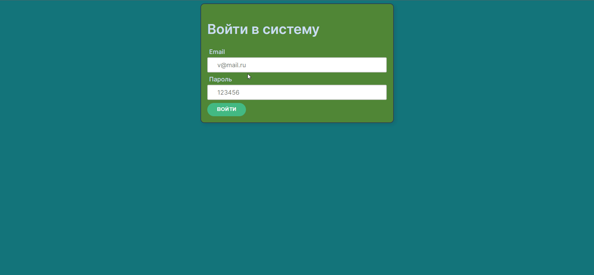

## Vue-alert

<div align="left">



#
## Проект сожержит
<details open>
  <summary >Vue</summary>

  [Что это?](https://vuejs.org/)

    Прогрессивный JavaScript-фреймворк

</details>

<details >
  <summary >VueX</summary>
 
  [Что это?](https://vuex.vuejs.org/) 
 
    Централизованное хранилище данных для всех компонентов приложения.
    Логика вынесена в отдельный модуль, входной точкой является файл store/index.js
</details>

<details >
  <summary > Vue router</summary>
 
  [Что это?](https://router.vuejs.org/) 

    Роутиг на страницах осуществляется через [<router-view>] без перезагрузки
    шапка сайта остается неизменной и не загружается при смене страниц
</details>

<!-- <details >
  <summary >TypeSctript for Vue</summary>
 
  [Что это?](https://vuex.vuejs.org/guide/typescript-support.html) 

    Vuex предоставляет свои типы, поэтому вы можете использовать TypeScript для написания определения хранилища. Вам не нужна специальная конфигурация TypeScript для Vuex. Пожалуйста, следуйте базовой настройке TypeScript Vue для настройки вашего проекта.
</details> -->

<!-- <details>
  <summary>SCSS</summary>
 
  [Что это?](https://sass-scss.ru/)  

    Вы можете изменять  настройки в вашем проекте. 
    Для  автоматического комполирования файлов css необходимо запустить 

  Live Sass Compiler 

  [Что это?](https://marketplace.visualstudio.com/items?itemName=ritwickdey.live-sass)  

    В проекте scss создает 2 css файла style-light style-dark 
    для разных цветовых тем.

    Конфигурации нужно изменять в файлах variables_light.scss variables_dark.scss 
</details> -->

<details>
  <summary>yup</summary>
 
  [Что это?](https://www.npmjs.com/package/yup) 
  Библиотека для валидации формы входа

</details>
<details>
  <summary>Локальный сервер</summary>
 
  [Что это?](https://ru.wikipedia.org/wiki/Localhost) 
 
  По умолчанию [localhost:8080](http://localhost:8080).
</details>


# 
## Для запуска потребуется
- этот репозиторий 
 ```
git clone https://github.com/VladislavBobyrev/
```
- node.js 
 
```
https://nodejs.org/en/
```

<!-- - Live Sass Compiler

 
```
https://marketplace.visualstudio.com/items?itemName=ritwickdey.live-sass
``` -->

- браузер

#
## Команды

|                        |                       |
|------------------------|:----------------------|
| Установить зависимости | `npm i`               |
| Запустить локально     | `npm run serve`       |
| Собрать                | `npm run build`       |
 
#
## Связвться со мной
<div align='center'> 
 
 ```
vladislavbobyrev@yandex.ru
```
 
 [](https://t.me/VladislavBobyrev)

 </div>
 
<div align="center">
  <h2>**ВНИМАНИЕ!**  Вся конфигурация является открытой. </h2>
 
**ВНИМАНИЕ!** На компьютере должны быть установлены программы `node` и `npm`.
Генерация  занимает много времени за счёт
установки `node_modules`. Необходимо дождаться окончания этого процесса.
 
</div>